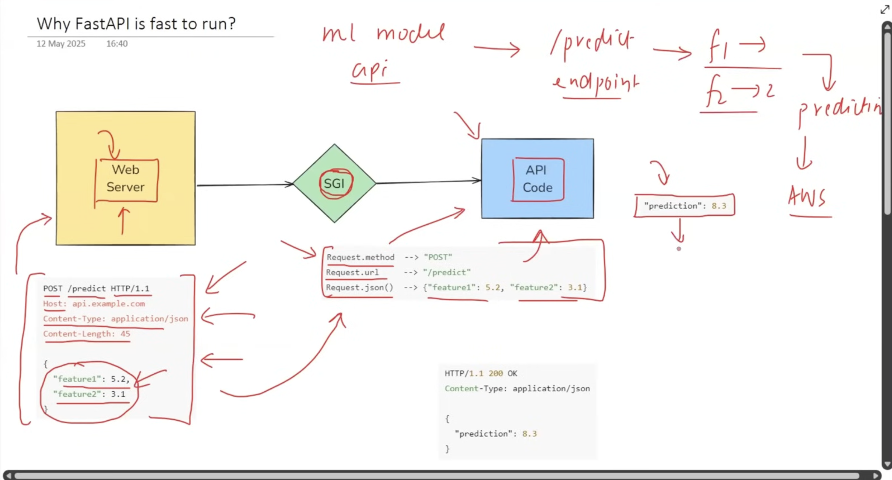

# FastAPI

### Topics covered in this repo are in 3 parts

##### Part 1: Fundamentals - (with the help of a project)

##### Part 2: ML Model integrate with FastAPI

##### Part 3: Deployment of ML API (AWS)

---

---

## Part 1: Fundamentals

---

### Video 1:

#### What is API?

Acc to s/w:
APIs are mechanisms that enable two software components-such as the frontend and the backend of an application-to communicate with each other using a defined set of rules, protocols, and data formats.
Basically a connector between two different software

#### Need for APIs

###### Pre API Era

In _Monolithic Architecture_ (application), here in this architecture a file will have everything innit a _Frontend_ Folder(it'll have components, style, utils, etc folders in it) and a _Backend_ Folder(it'll have controllers, models, routes, service, etc folders in it)
sooooo,
_Db <--> Backend <--> Frontend_
All of these 3 can communicate with each other without needing of an API
The Backend and Frontend is _Tightly Coupled_ here, which means if any component goes through a problem/change then affect the whole project
Before APIs websites were developed with the help of _Monolithic Architecture_ only

###### Problem Case for the need of APIs

Ex -> we have the govt. IRTC website and we have a DB which has the info about the trains and the timings
This DB is connected with the Backend and the Frontend
The Backend we have uses the chosen filter, protocolsm rules, data formats, etc. to only show/provide only the specific info to user to secure the confidential data.

Now, the companies like Makemytrip, Yatra, ixigo approached us to share them the data for money behind per search of the train so that the users of their platform can access the timings of the trains and can book their tickets from their websites
But, we can't give them the access to the govt.-confidential data sooo we give them the _access to the Backend_ soo that they can only access the selected data that we decided to show them

But since the Backend we have now is not an independent application and it is tightly coupled with the Frontend and the DB resulting into failure of this giving access to the Backend Technique (we can't share the data of the DB to any other application outside out our Monolithic Architecture)

This results into the loss of profit for the IRCTC Website cause they can't share their DATA to the other companies to earn more money,
This problem is Solved using APIs

_PROBLEM 2_ and its solution
Since user uses Androids, iOS, Windows. All the DBs for these 3 will be different cause different platforms. But with the API we can simply connect the all 3 different frontends of Android, iOS and Windows with the API layer -> Backend -> DB. Soo that their is no need of multiple structures for different platforms.
Most of the MNCs (googlec, facebook) uses this architecture because it is easy!

###### Solution for the Above problem with API

_Steps :-_ _Stop_ Using *Monolithich Archi*tecture / *Decouple App*lication

- Build Frontend alag se, Build Backend alag se
- That means the Backend will be a different application and the Frontend will be a different application
- Add a layer of API after Backend i.e. DB<-->Backend<-->API, here the APIs are basically endpoints they are basically some special type of functions which are publically available to view and access
- Ex. we created a "/Trains" function which is basically a spl function which is availale on the internet soo anyone can access it
- we wrote in the function that if anyone hit on the url of the train function then what we will do bts is --> we'll call the "Fetch Trains" function of the Backend --> this function will thereafter will go to the DB, it'll bring the data and will submit it to the /Trains endpoint (API) soo the User/public can access it
- The companies will hit the /Trains API url and the above flow will take place and the companies will recieve the data
- We can also apply constraints on the API too soo that no malicious info can transfer
- Since our Frontend is an independen App now, it too can acess the DB/Backend with the help of API now
- the data format we use here is _JSON_ since it is a universal data format. i.e. if Makemytrip is built in Python and Yatra is built in Java sooo the API will need to share the data which both languages can understand, which is "JSON"

##### API - ML Perspective

- The DB was imp in the above cases(s/w cases) but in ML/DL the ML Model is the most imp thing
- Everything else is the same
- Ex. ChatGpt, the OpenAI built this model and wanted to share it to the world
- So inorder to share they cant publicly share the model obviously, soo they used the similar struct like previous above structures
- _Previous ML Monolithic Architecture :-_ ML Model <--> Backend <--> Frontend
- _Present ML API Architecture :-_ ML Model <--> Backend <--> API
- For the multiple platform it is same as the DB based we discussed earlier above in the problem case

---

### Video 2: FastAPI Philosophy, Setup, Installation and Code Demo

#### FastAPI?

FastAPI is a modern, high-performance web framework for building APIs with Python
FastAPI is built upon 2 famous python libraries:Starlette and Pydanctiv

- Starlette: Starletter anages how your API receives requests and sends back responses, used to process HTTP requests.
- Pydantic: Pydantic is used to check if the data comingg into your API is correct and in the right format, it is used for Data Validation.

#### Philosophy of FastAPI

- APIs made in FastAPI will be Fast to Run
- API building will be Fast, Fast to code

##### Why FastAPI is fast to run?

ML model api --> /predict (endpoint) --> f1 & f2 (input1/2) = prediction

image 

Client <--> Web Server (aws) <--> SGI (Server Gateway Interface) <--> API Code
SGI - converts data into python understandable format (translator), it establishes 2 way communction between API code and Web Server

##### Types of SGI

- WSGI: Web-SGI is used in Flask for the 2 way communication, its limitations are that it is of synchronous nature (only 1 req per time), it also has blocking nature(it stops the other tasks because all the resources are blocked because theyre been used for the 1st task). Webserver used for WSGI (in Flask) is Gunicorn which is a WSGI HTTP server (this server is not recommended for scalable APIs because high latency and performance issues)

- ASGI: Asynchronous-SGI is used in Fast API, it can do concurrent processes the library used to implement ASGI in Fast is Starlette and WebServer used in ASGI is Uvicorn which is generally preffered for its performance and asynchronous capabilities. FastAPI supports async and await features of python, it helps in parallel processing

##### Why FastAPI is fast to code?

1. Automatic Input Variable (by default supports pydantic, which mean whenever an endpoint is created we can specify the input which we are receiveing is of which data type, the integration of FastAPI and pydantic is tightly coupled)
2. _Auto-Generated_ Interactive _Documentation_ (not only we can understand aboutthe API here but also can interact with them)
3. Seamless Integration with Modern Ecosystem (ML/DL Libraires, OAuth, JWT, SQL Alchemy, Docker, Kubernetes, etc.)

##### Code:

```
from fastapi import FastAPI

app = FastAPI() #object of FastAPI class is created and stored in the variable app

@app.get("/") # Define a GET endpoint at the root URL ("/"), the get signifies that this endpoint will respond to GET requests
#to fetch data from the server get request is used and to send data to the server post request is used
def hello():
    return {'message':'Hello World'} #return a JSON response with a message key and a value of "Hello, World!"

```

##### On terminal:

```
(myenv) (base) omkarpatkar@Omkar FastAPI % cd fastapi-tutorials
(myenv) (base) omkarpatkar@Omkar fastapi-tutorials % uvicorn main:app --reload
```

##### Auto-Generated Documentation:

If you hit /docs on the url
Ex. :- http://127.0.0.1:8000/docs
it'll show you the documentation and also the information about it and it also allows to interact over there (no need of s/w like postman)

---

### Video 3:
