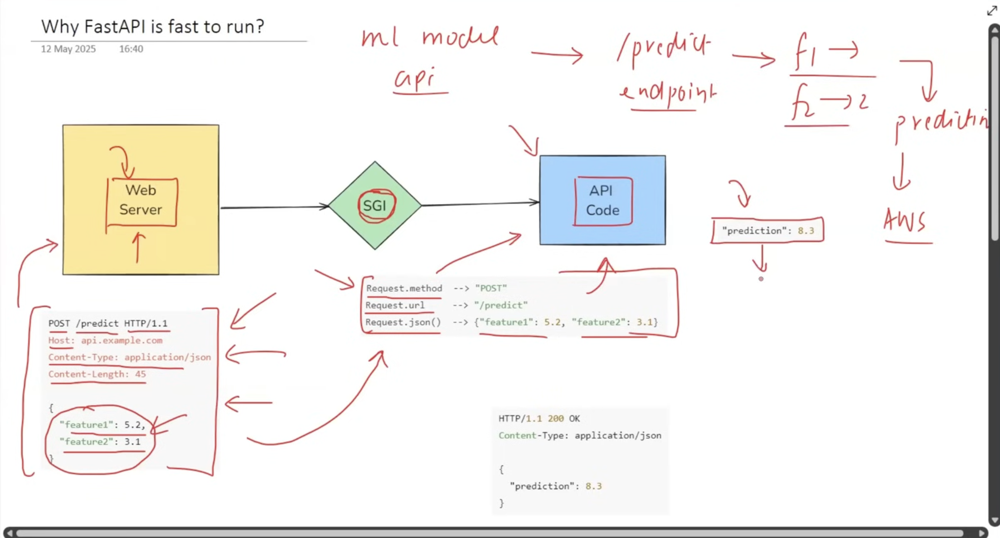

# FastAPI

### Topics covered in this repo are in 3 parts

##### Part 1: Fundamentals - (with the help of a project)

##### Part 2: ML Model integrate with FastAPI

##### Part 3: Deployment of ML API (AWS)

---

---

## Part 1: Fundamentals

---

### Video 1:

#### What is API?

Acc to s/w:
APIs are mechanisms that enable two software components-such as the frontend and the backend of an application-to communicate with each other using a defined set of rules, protocols, and data formats.
Basically a connector between two different software

#### Need for APIs

###### Pre API Era

In _Monolithic Architecture_ (application), here in this architecture a file will have everything innit a _Frontend_ Folder(it'll have components, style, utils, etc folders in it) and a _Backend_ Folder(it'll have controllers, models, routes, service, etc folders in it)
sooooo,
_Db <--> Backend <--> Frontend_
All of these 3 can communicate with each other without needing of an API
The Backend and Frontend is _Tightly Coupled_ here, which means if any component goes through a problem/change then affect the whole project
Before APIs websites were developed with the help of _Monolithic Architecture_ only

###### Problem Case for the need of APIs

Ex -> we have the govt. IRTC website and we have a DB which has the info about the trains and the timings
This DB is connected with the Backend and the Frontend
The Backend we have uses the chosen filter, protocolsm rules, data formats, etc. to only show/provide only the specific info to user to secure the confidential data.

Now, the companies like Makemytrip, Yatra, ixigo approached us to share them the data for money behind per search of the train so that the users of their platform can access the timings of the trains and can book their tickets from their websites
But, we can't give them the access to the govt.-confidential data sooo we give them the _access to the Backend_ soo that they can only access the selected data that we decided to show them

But since the Backend we have now is not an independent application and it is tightly coupled with the Frontend and the DB resulting into failure of this giving access to the Backend Technique (we can't share the data of the DB to any other application outside out our Monolithic Architecture)

This results into the loss of profit for the IRCTC Website cause they can't share their DATA to the other companies to earn more money,
This problem is Solved using APIs

_PROBLEM 2_ and its solution
Since user uses Androids, iOS, Windows. All the DBs for these 3 will be different cause different platforms. But with the API we can simply connect the all 3 different frontends of Android, iOS and Windows with the API layer -> Backend -> DB. Soo that their is no need of multiple structures for different platforms.
Most of the MNCs (googlec, facebook) uses this architecture because it is easy!

###### Solution for the Above problem with API

_Steps :-_ _Stop_ Using *Monolithich Archi*tecture / *Decouple App*lication

- Build Frontend alag se, Build Backend alag se
- That means the Backend will be a different application and the Frontend will be a different application
- Add a layer of API after Backend i.e. DB<-->Backend<-->API, here the APIs are basically endpoints they are basically some special type of functions which are publically available to view and access
- Ex. we created a "/Trains" function which is basically a spl function which is availale on the internet soo anyone can access it
- we wrote in the function that if anyone hit on the url of the train function then what we will do bts is --> we'll call the "Fetch Trains" function of the Backend --> this function will thereafter will go to the DB, it'll bring the data and will submit it to the /Trains endpoint (API) soo the User/public can access it
- The companies will hit the /Trains API url and the above flow will take place and the companies will recieve the data
- We can also apply constraints on the API too soo that no malicious info can transfer
- Since our Frontend is an independen App now, it too can acess the DB/Backend with the help of API now
- the data format we use here is _JSON_ since it is a universal data format. i.e. if Makemytrip is built in Python and Yatra is built in Java sooo the API will need to share the data which both languages can understand, which is "JSON"

##### API - ML Perspective

- The DB was imp in the above cases(s/w cases) but in ML/DL the ML Model is the most imp thing
- Everything else is the same
- Ex. ChatGpt, the OpenAI built this model and wanted to share it to the world
- So inorder to share they cant publicly share the model obviously, soo they used the similar struct like previous above structures
- _Previous ML Monolithic Architecture :-_ ML Model <--> Backend <--> Frontend
- _Present ML API Architecture :-_ ML Model <--> Backend <--> API
- For the multiple platform it is same as the DB based we discussed earlier above in the problem case

---

### Video 2: FastAPI Philosophy, Setup, Installation and Code Demo

#### FastAPI?

FastAPI is a modern, high-performance web framework for building APIs with Python
FastAPI is built upon 2 famous python libraries:Starlette and Pydanctiv

- Starlette: Starletter anages how your API receives requests and sends back responses, used to process HTTP requests.
- Pydantic: Pydantic is used to check if the data comingg into your API is correct and in the right format, it is used for Data Validation.

#### Philosophy of FastAPI

- APIs made in FastAPI will be Fast to Run
- API building will be Fast, Fast to code

##### Why FastAPI is fast to run?

ML model api --> /predict (endpoint) --> f1 & f2 (input1/2) = prediction

image 

Client <--> Web Server (aws) <--> SGI (Server Gateway Interface) <--> API Code
SGI - converts data into python understandable format (translator), it establishes 2 way communction between API code and Web Server

##### Types of SGI

- WSGI: Web-SGI is used in Flask for the 2 way communication, its limitations are that it is of synchronous nature (only 1 req per time), it also has blocking nature(it stops the other tasks because all the resources are blocked because theyre been used for the 1st task). Webserver used for WSGI (in Flask) is Gunicorn which is a WSGI HTTP server (this server is not recommended for scalable APIs because high latency and performance issues)

- ASGI: Asynchronous-SGI is used in Fast API, it can do concurrent processes the library used to implement ASGI in Fast is Starlette and WebServer used in ASGI is Uvicorn which is generally preffered for its performance and asynchronous capabilities. FastAPI supports async and await features of python, it helps in parallel processing

##### Why FastAPI is fast to code?

1. Automatic Input Variable (by default supports pydantic, which mean whenever an endpoint is created we can specify the input which we are receiveing is of which data type, the integration of FastAPI and pydantic is tightly coupled)
2. _Auto-Generated_ Interactive _Documentation_ (not only we can understand aboutthe API here but also can interact with them)
3. Seamless Integration with Modern Ecosystem (ML/DL Libraires, OAuth, JWT, SQL Alchemy, Docker, Kubernetes, etc.)

##### Code:

```
from fastapi import FastAPI

app = FastAPI() #object of FastAPI class is created and stored in the variable app

@app.get("/") # Define a GET endpoint at the root URL ("/"), the get signifies that this endpoint will respond to GET requests
#to fetch data from the server get request is used and to send data to the server post request is used
def hello():
    return {'message':'Hello World'} #return a JSON response with a message key and a value of "Hello, World!"

```

##### On terminal:

```
(myenv) (base) omkarpatkar@Omkar FastAPI % cd fastapi-tutorials
(myenv) (base) omkarpatkar@Omkar fastapi-tutorials % uvicorn main:app --reload
```

##### Auto-Generated Documentation:

If you hit /docs on the url
Ex. :- http://127.0.0.1:8000/docs
it'll show you the documentation and also the information about it and it also allows to interact over there (no need of s/w like postman)

---

### Video 3: HTTP Methods || GET Method

#### Problem Statement

Endpoints

- /create (create patients) -> json
- /view (view patients)
- /view|patient_id (too view a particular patient)
- /update|patient_id (update data of a particular patient)
- /delete|pateint_id

#### Types of Software

- Static (ex. Clock app, Calendar, Blog Website, etc) -> it does not work on any data, it only shows the data it has to the user

- Dynamic (Excel, Instagram Website etc) -> it lets us modify, delete, update and crreate data
  We can only perform **4 Operations** on the Dynamic S/W (CRUD Operations)
  - Create
  - Retrieve/Read
  - Update
  - Delete

##### A Website is a software installed/running on a Server, and it is accessed by user (Client) through the Client's (User's) PC

[Client pc] <-----> [Website](runnning on server)
These both interact via INTERNET/ HTTP

Ex. We want to retreive our profile from the Website(which is installed/running on the server) then we send a verb with the HTTP request, which is;

- Profile Retrieve: HTTP -> Verb -> GET (Retreive Interaction) \*Used frequently
- Posting Pic/Data: HTTP -> Verb -> POST (Create Interaction) \*Used frequently
- Updating Exisiting resource: HTTP -> Verb -> PUT (Update Interaction)
- Delete Existinf resource: HTTP -> Verb -> DELETE (Delete Interaction)

---

### Video 4: Path & Query Parameters

#### Path Params

Path parameters are dynamic segments of a URL path used to identify a specific resource

- In like previous vid, we saw that if we want to access the data of all patients we hit the /view endpoint | localhost:8000/view
- But what if we want to access a specific patient?
- localhost:8000/view/3 | The 3 here is a dynamic part which can be changed, with anyother patient number, the 3 part/endpoint is a dynamic potion which locates a **specific resource**.
- This is what a Path Parameter do, the **3** here is the **Path Parameter**
- Helps to Retrieve, Update and Delete specific user/patients data

##### New Code

in this endpoint the client/user can access any patient data that he want and we will achieve this by Path Parameters

##### Path()

The _Path function in FastAPI is used to provide_ metadata, validation rules, and documentation _hints for path parameters in your API endpoints._

- Title
- Description
- Example
- ge, gt, le, lt (greater equal to, greater than, less than equal to, less than)
- Min_length
- Max_length
- regex

#### HTTP Status code

They are **3-digit numbers** returned by a webserver (like FastAPI) to indicate the **result** of a client's request (like from a browser or API consumer)
Ex:-

- 2xx | Success | The req was successfully recieved and processed
- 3xx | Redirection | Further action needs to be taken (e.g. redirect)
- 4xx | Client Error | Something is wrong with the request from the client
- 5xx | Server Error | Something went wrong on the server side

200 OK | Standard Success | A _get_ or _post_ succeeded
201 Created | Resource Created | Alter a _post_ that creates something
204 No Content | Success but no data returned | After a _Delete_ request

400 Bad Request | Malformed or invalid request | Missing field wrong data type
401 Unauthorized | No/invalid authentication | Login required
403 Forbidden | Authenticated, but no permission | Logged inbut not allowed
404 Not Found | Resource doesn't exist | Patient ID not in DB

500 Internal Server Error | Generic Failure | Something broke on the server
502 Bad Gateway | Gateway (like Nginx) failed to reach backend
503 Service Unavailable | Server is down or overloaded

##### HTTPException

HTTPException is a special built-in exception in FastAPI used to _return custom HTTP error responses_ when something goes wrong in your API
Instead of returning a normal JSON or crashing the server, you can _generally raise an error_ with:

- a proper HTTP status code (like 404, 400, 403, etc)
- a custom error message
- (optional) extra headers

#### Query Parameter

Query parameters are optional key-value pairs appended to th end of a URL used to _pass additional data_ to the server in an HTTP request. They are typically employed for operations like filtering, sorting, searching, and pagination, without altering the endpoint path itself

- the data which was showing to client with the /view endpoint is same to the data how it was added in the DB (unsorted)
- But what if we want to show the sorted data instead of the normal data?
- ex, sorting on weight/height/bmi in asc/desc

Ex- _/patients?city=Delhi&sort_by=age_

- the _?_ marks the start of query param
- Each param is a key-vlaue pair: key=value
- Multiple param are separated by &

##### Query()

Query() is a utility function provided by FastAPI to declare, validate, and document _query parameters_ in your API Endpoints
It allows you to:

- set _default values_
- Enforce _validation rules_
- Add _metadata_ like description, title, examples

same as Path()

##### New Endpoint

sort patients -> query -> sortyby -> weight, height, bmi
|\_ query -> order -> asc, desc

---

### Video 5: Pydantic Crash Course | Data Validation in Python

#### Why Pydatanic we need here?

Overview: pydantic solves 2 major problems

- Type Validation
- Data Validation

#### Pydantic

- **Define a Pydantic model**(class) that represents the **ideal schema** of the data.
  - This includes the expected fields, their types and any validation constraints (e.g. _gt=0_ for positive numbers)
- **Instantiate the model with raw input data** (usually a dict or JSON-like structure)
  - Pydantic will automatically **validate** the date and **coerce** it into the correct Python types (if possible)
  - if the data doesn't meet the model's requirements. pydantic raises a _ValidationError_ ((e.g. {name -> Omkar, age -> 21}) -> this dict is traferred to the class obj (in this process the data ets automatically validated)) -> here we get the validated pydantic model
- **Pass the validated model object** to functions or use it throughout your codebase
  - This ensures that every part of your program works with **clean, type-safe, and logically valid data**
    (the validated pydantic object we recieve here, our function performs the logic when it recieves this obj )

##### 2 versions of Pydantic, Use Pydantic v2 cause it is written in Rust and it is FAST because of it and it is mostly used now

##### Flow

- pydantic_why_1.py
-
-
- pydantic_type_validation.py
- pydantic_data_validation.py
  - pydantic provides built in data type for data validation, ex:- _EmailStr_, _AnyUrl_

##### Field Function

It is used for putting some customs field,
i.e. If your business requires age between 0-60,then these functions come to the help
This can be used for Numerical and Str based data types bpth
Ex; - weight: float = field(gt=0), age: int = Field(gt=0, lt=120)

It is not only used for **Data Validation** but it is also used to _attach_ **Metadata**

To attach _Metadata_(description, title, etc) we need to import and use _Annotated_ from typing module

Other everything is in omkaaaaaar/pydantic repo

---

### Video 6: Post request in FastAPI

##### What is request body?

A request body is the portion of an HTTP request that contains data sent by the client to the server. It is typically used in HTTP methods such as a POST or PUT (update) to transmit structured data(e.g. JSON, XML, form-data) for the purpose of creating or updating resources on the server. \*The server parses the request body to extract the necessary information and perform the intended operation.

- Step 1: Basically, in this process of creating the endpoint the request sent by the client to the server in the form of HTTP request will be POST, with which the client will also share the request body which will consist of the patient info(in this case of hospital management; patient info), With the help of this data we will create a new data on the backend
- Step 2: Validation - We'll validate the data sent by the client to the server; e.x., the client sent us the age as "Thirty" as a str which is not acceptable (cuz we are expecting int). So we'll need to validate the data. We will make a Pydantic model inorder to perform Data Validation here. If the data is validated with the help of the model then we'll continue or if not then we will raise a error
- Step 3: Adding/Storing the record - If the data is validated then we will add our record in the JSON File

---

### Video 7: PUT & DELETE in FastAPI

##### Today

Today in this part we will create 2 more new Endpoints

- Update
- Delete

#### Update Endpoint

We will create **/edit** endpoint today,
where the client will provide _patient_ID_ and a _request_body_ (in request body, the client will mention what are the changes are need to be done. ex: {city: 'Mumbai', weight: 72.3})

The HTTP method we will use here will be **PUT**
Tricky Part:- Client might need to change everyting of a particular patient or only a specific info, which we don't know yet. Soo we'll need to structure our logic in a way that even if the client changes the particular info or everything, our update mechanism should work in both of these two changes

Step 1 - Create a new Pydantic Model
(we can't use our previous model here bcuz, every fields in the previous model are required, so the pre-existing model will expect every required fields, but we are now only updating and not creating model and we don't knwo if client will provide everything which is required: SO, we are creating a new pydantic model)
In the new model we will keep all the fields optional

Step 2 - Once the data is validated we will update it in the existing value
